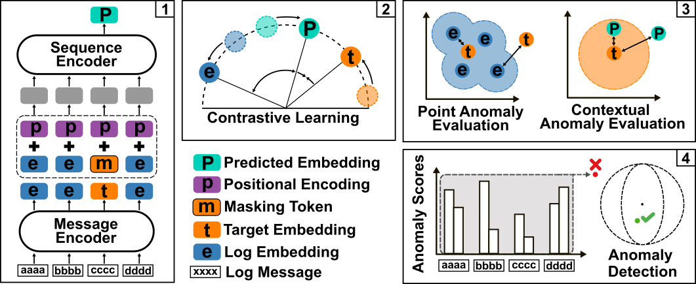

# ContraLog: Log File Anomaly Detection with Contrastive Learning and Masked Language Modeling


This GitHub repository provides the supplementary materials for the research paper, "[ContraLog: Log File Anomaly Detection with Contrastive Learning and Masked Language Modeling](https://arxiv.org/abs/2602.03678)".
<div align="center">

<!-- [[`Paper`](/)]  [[`BibTex`](#citation)] -->

[](https://arxiv.org/abs/2602.03678)
[](#citation)



</div>


ContraLog is a self-supervised method for detecting anomalies in log files without relying on log parsers. Traditional approaches first parse log messages into discrete templates, discarding variable values and semantic content. ContraLog instead operates directly on raw log messages by predicting continuous message embeddings.

Log files are a primary source of operational insights in modern computer systems, recording events that reflect system state and behavior. Detecting anomalies in logs is critical for system monitoring, security, and predictive maintenance. However, most existing methods depend on log parsers that collapse messages into template IDs, losing valuable information in the process.

ContraLog addresses this limitation by:

- **Parser-free**: Operates directly on raw log messages without requiring a separate parsing step
- **Continuous embeddings**: Predicts message embeddings rather than discrete template IDs, preserving semantic information
- **Self-supervised**: Combines masked language modeling with contrastive learning to learn from unlabeled log data
- **Hierarchical architecture**: Uses a message encoder for individual log messages and a sequence encoder for temporal dependencies

## Installation and Data
<details open>
<summary>Windows</summary>

```
git clone ...
cd contra_log
python -m venv .venv
call .venv/Scripts/activate.bat
pip install -r requirements.txt
```
</details>
<details>
<summary>Linux & macOS </summary>

```
git clone ...
cd contra_log
python3 -m venv .venv
source .venv/bin/activate
pip install -r requirements.txt
```
</details>

Download raw data at [LogHub](https://github.com/logpai/loghub) and place folders into `/data`. This repository is setup to handle *HDFS_V1*, *BGL* and *Thunderbird*. 
For testing the implementation, we also provide a small [`toy dataset`](data/raw/toy_bgl.log), derived from BGL.

## Training and Testing
`/contralog/config` contains configuration files for the most important model and training parameters for each dataset. You can either edit the config files for each dataset directly or create your own and then reference them in [`main.toml`](contralog/config/main.toml). Once data and configurations are ready you can call the following commands to process raw data, train, and test models:
```
python main.py --script make_data --dataset ToyDataset
python main.py --script train --dataset ToyDataset
python main.py --script test --dataset ToyDataset
```
Some artifacts will be automatically saved to the `/model` folder during training and testing. 

If you want to work with a custom dataset you also have to implement a new helper function to be called during the `make_data` step in [`main.py`](main.py) . 
This function should return the logs split into sessions and the corresponding labels. You can take inspiration from the existing data parsers for hdfs, bgl, and thunderbird. 
<details>
<summary>HDFS, BGl, Thunderbird</summary>

```
python main.py --script make_data --dataset HDFS
python main.py --script train --dataset HDFS
python main.py --script test --dataset HDFS

python main.py --script make_data --dataset BGL
python main.py --script train --dataset BGL
python main.py --script test --dataset BGL

python main.py --script make_data --dataset TBird
python main.py --script train --dataset TBird
python main.py --script test --dataset TBird
```
Standard configurations were tested with 24GB of VRAM. If you are running less than that you might have to reduce batch size or the model sizes.

</details>

## Config Guide

<details>
<summary>Click here for details.</summary>

This section describes the main configuration options for ContraLog. Each parameter can be set in the config files under `/contralog/config`.

---
### Training Configuration


#### [Data]
| Parameter                   | Description                                                                 |
|-----------------------------|-----------------------------------------------------------------------------|
| `raw_path`                  | Path to raw log file.                                                       |
| `data_path`                 | Directory for storing preprocessed sequences.                               |
| `n_workers`                 | Number of workers for the DataLoader.                                       |
| `train_frac`                | Fraction of sequences used for training.                                    |
| `val_frac`                  | Fraction of sequences used for validation.                                  |
| `fit_frac`                  | Fraction of sequences used to calculate anomaly score threshold.            |
| `test_frac`                 | Fraction of sequences reserved for testing.                                 |
| `balance_test`              | Balance normal and abnormal sequences in the test set if `true`.            |
| `tokenizer_fit_samples`     | Number of logs used to fit the tokenizer.                                   |
| `window_size`               | Log window size (in seconds) for session extraction.                        |
| `max_samples`               | Maximum number of logs per window.                                          |

#### [Train]
| Parameter         | Description                                              |
|-------------------|----------------------------------------------------------|
| `n_max_epochs`    | Maximum number of training epochs.                       |
| `lr`              | Learning rate.                                           |
| `n_mask`          | Masking ratio.                                           |
| `max_grad_norm`   | Maximum gradient norm for gradient clipping.             |
| `batch_size`      | Training batch size.                                     |

#### [EarlyStopping]
| Parameter   | Description                                                        |
|-------------|--------------------------------------------------------------------|
| `patience`  | Number of epochs with no loss improvement before early stopping.   |
| `min_delta` | Minimum improvement in loss to prevent early stopping.             |

#### [Misc]
| Parameter                    | Description                                                      |
|------------------------------|------------------------------------------------------------------|
| `device`                     | Training device, e.g., `'cpu'` or `'cuda'`.                      |
| `save`                       | Save model weights, config, and optimizer if `true`.             |
| `save_path`                  | Directory for storing models.                                    |
| `run_name`                   | Name of the run (used in save location).                         |
| `warm_start`                 | Load a pre-trained model to start training if `true`.             |
| `warm_start_model_path`      | Path to pre-trained model.                                        |
| `calc_tokenizer_stat`        | Calculate statistics after fitting a new tokenizer if `true`.     |
| `n_sequences_tokenizer_stats`| Number of log sequences for tokenizer statistics.                 |
| `store_loss`                 | Store loss values in a CSV if `true`.                            |
| `plot_loss`                  | Plot and save loss if `true`.                                    |

#### [Test]
| Parameter                       | Description                                                        |
|----------------------------------|--------------------------------------------------------------------|
| `model_path`                    | Path to the model to be tested.                                    |
| `percentile_threshold`           | Percentile of normal anomaly scores used as threshold.             |
| `max_point_anomaly_ref_samples`  | Number of reference sequences for point anomaly detection.         |
| `max_threshold_fit_samples`      | Maximum number of sequences for anomaly threshold calculation.     |
| `max_test_samples`               | Maximum number of samples for test metrics calculation.            |
| `balance_test`                   | Balance normal and abnormal sequences in the test set if `true`.   |

---

### Model configuration
| Parameter               | Description                                                                 |
|-------------------------|-----------------------------------------------------------------------------|
| `max_log_len`           | Maximum number of tokens in a single log message.                          |
| `max_sequ_len`          | Maximum number of log messages in a sequence.                              |
| `tokenizer_vocab_len`   | Size of the tokenizer's vocabulary (number of unique tokens).               |
| `emsize`                | Size of the embedding vector for each token in the log message.            |
| `d_hid_emb`             | Hidden dimension size for the embedding model's feedforward layers.        |
| `n_layers_emb`          | Number of transformer layers in the embedding model.                       |
| `n_head_emb`            | Number of attention heads in the embedding model's multi-head attention.   |
| `dropout_embedder`      | Dropout rate for the embedding model.                                       |
| `d_hid_sequ`            | Hidden dimension size for the sequence model's feedforward layers.         |
| `n_layers_sequ`         | Number of transformer layers in the sequence model.                        |
| `n_head_sequ`           | Number of attention heads in the sequence model's multi-head attention.    |
| `dropout_sequ_model`    | Dropout rate for the sequence model.   

</details>

## Structure
```
ContraLog
│   main.py--------------------------> Main script for training & testing
│   requirements.txt-----------------> pip install -r requirements.txt
│
├───contralog
│   │   data_loaders.py--------------> Simple data loader for processed sequences
│   │   inference_scripts.py---------> Scripts for detecting anomalies (with trained model)
│   │   log_embedder.py--------------> Wrapper for more flexible embedding
│   │   models.py--------------------> Main model files for MessageEncoder and SequenceEncoder
│   │   trainer.py-------------------> Class for handling the training
│   │
│   └───config-----------------------> Folder for holding configuration files
│           main.toml----------------> Main config (make entry for custom data here)
│           model_conf_bgl.toml
│           model_conf_hdfs.toml
│           model_conf_tbird.toml
│           model_conf_toy.toml
│           train_conf_bgl.toml
│           train_conf_hdfs.toml
│           train_conf_tbird.toml
│           train_conf_toy.toml
│
├───data----------------------------> Data will be stored in this directory
│   └───raw
│           toy_bgl.log-------------> Small toy dataset for testing
│
├───helper
│       bgl.py----------------------> Helper scripts for processing raw BGL logs
│       hdfs.py---------------------> Helper scripts for processing raw HDFS logs
│       LogDataUtil.py--------------> Utility class for managing data
│       tbird.py--------------------> Helper scripts for processing raw Thunderbird logs#
│       visualize.py----------------> Some scripts for plotting
│
└───models--------------------------> Models will be saved in this directory
```

## Citation
If you found this code useful, please cite the following paper:
```
@misc{dietz2026contraloglogfileanomaly,
      title={ContraLog: Log File Anomaly Detection with Contrastive Learning and Masked Language Modeling}, 
      author={Simon Dietz and Kai Klede and An Nguyen and Bjoern M Eskofier},
      year={2026},
      eprint={2602.03678},
      archivePrefix={arXiv},
      primaryClass={cs.LG},
      url={https://arxiv.org/abs/2602.03678}, 
}
```